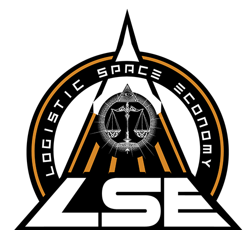
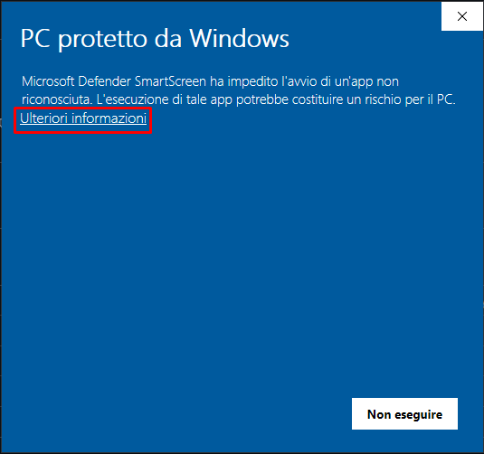
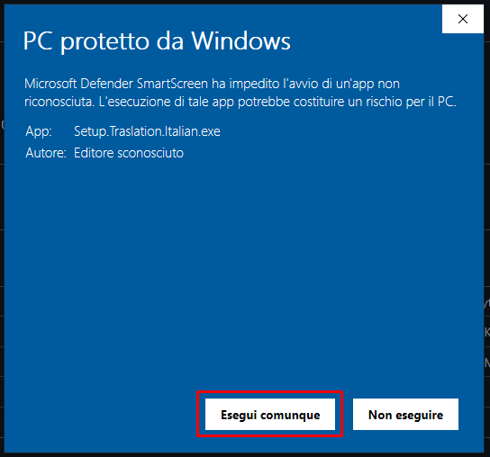

  

# Traduzione Italiano Star-Citizen

   
   

## Questa è una traduzione pubblica fatta da Mr Revo per la ORG LSE

# Instalazione

**ATTENZIONE**: Usare solo uno dei due metodi

#### Instalazione Setup (Consigliata)

1. Scaricare installer `Setup Traslation Italian.exe` dal seguente [link](https://github.com/ORG-LSE/Traduzione_Italiano_Star-Citizen/releases/latest)
2. Cliccare per eseguire installazione
   AVVISO: Windows potrebbe mostrare un messaggio che il file non è sicuro perchè non riesce a verificare la firma digitale **installer è sicuro**.
   Per ovviare al problema basta cliccare su `Ulteriori Informazioni` e poi su `Esegui Cominque`.
   
   
   
   
3. Accettare i termini
4. Selezionare la versione di Star-Citizen LIVE o PTU
5. Premere sul tasto **Installa traduzione**
6. Aspettare che finisca il programma si chiude da solo al termine della operazione

#### Instalazione Manuale

1. Scaricare il File `global.ini` dal seguente [link](https://drive.google.com/uc?export=download&id=1nS6AvSXgctANr-enrFg5XkZVUdY4N5qH)
2. Aprire la cartella di installazione di Star-Citizen es: `C:\Program Files\Roberts Space Industries\StarCitizen\LIVE`
3. Aprire il file zip e trascinare la cartella `data` dentro la cartella installazione di Star-Citizen aperta in precedenza
4. Creare la sotto cartella `Localization` al suo interno una altra sotto cartella `italian_(italy)`
5. Spostare il File `global.ini` precedente mente scaricato in questa cartella appena creata `italian_(italy)`
6. In stallzione completata

# Uninstalla

**ATTENZIONE**: Se per installare si è usato il metodo **Setup** seguire solo il metodo **tramite Setup**.
Perchè il Metodo **Manuale** non può disinstalare correttamente e pulire i registri di sistema.

#### Metodo tramite Setup

1. Aprire installer `Setup Traslation Italian.exe`
2. Accettare i termini
3. Selezionare la versione di Star-Citizen LIVE o PTU
4. Premere sul tasto **Rimuovi traduzione**
5. Aspettare che finisca il programma si chiude da solo al termine della operazione

#### Metodo Manuale

1. Aprire la cartella di installazione di Star-Citizen es: `C:\Program Files\Roberts Space Industries\StarCitizen\LIVE`
2. Aprire la cartella `data` cercare la cartella `Localization` aprila.
3. Trovare la cartella `italian_(italy)` e eliminarla.
