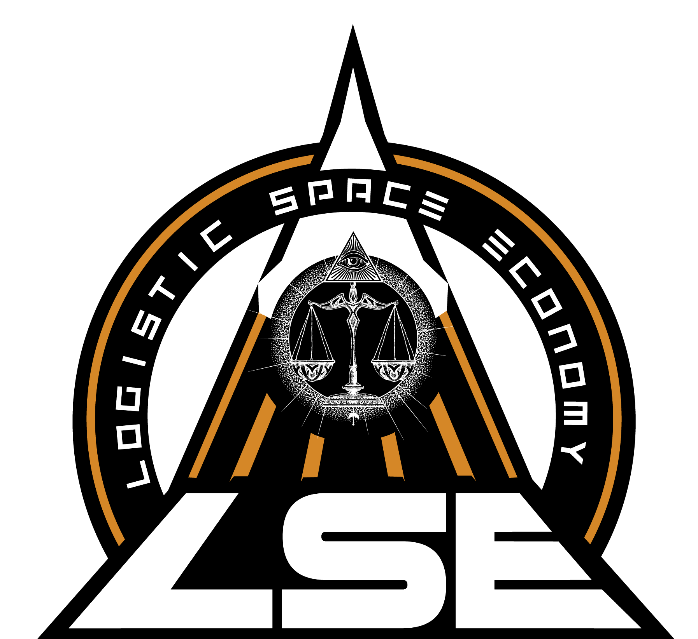

   

# Traduzione Italiano Star-Citizen

## Questa è una traduzione pubblica fatta da Mr Revo per la ORG LSE

# Instalazione

**ATTENZIONE**: Usare solo uno dei due metodi

#### Instalazione Setup (Consigliata)

1. Scaricare installer `Setup Traslation Italian.exe` dal seguente [link](https://github.com/ORG-LSE/Traduzione_Italiano_Star-Citizen/releases/latest)
2. Cliccare per eseguire installazione
   AVVISO: Windows potrebbe mostrare un messaggio che il file non è sicuro perchè non riesce a verificare la firma digitale **installer è sicuro**.
   Per ovviare al problema basta cliccare su `Ulteriori Informazioni` e poi su `Esegui Cominque`.
    
3. Proseguire seguendo la procedura guidata del setup.

#### Instalazione Manuale

1. Scaricare il File `Manual Setup Traslation Italian.zip` dal seguente [link](https://github.com/ORG-LSE/Traduzione_Italiano_Star-Citizen/releases/latest)
2. Aprire la cartella di installazione di Star-Citizen es: `C:\Program Files\Roberts Space Industries\StarCitizen\LIVE`
3. Aprire il file zip e trascinare la cartella `data` dentro la cartella installazione di Star-Citizen aperta in precedenza
4. In stallzione completata

# Uninstalla

**ATTENZIONE**: Se per installare si è usato il metodo **Setup** seguire solo il metodo **tramite Setup**.
Perchè il Metodo **Manuale** non può disinstalare correttamente e pulire i registri di sistema.

#### Metodo tramite Setup

1. Andare sullo start e aprire le impostazioni
2. Aprire la pagina `APP` e andare nella sezione `App e Funzionalita`
3. Cercare  `Traduzione in Italiano` clicare sopra per far spuntare il tasto Uninstalla
4. Seguire la procedura guidata del Uninstaller

#### Metodo Manuale

1. Aprire la cartella di installazione di Star-Citizen es: `C:\Program Files\Roberts Space Industries\StarCitizen\LIVE`
2. Aprire la cartella `data` cercare la cartella `Localization` aprila.
3. Trovare la cartella `italian_(italy)` e eliminarla.
